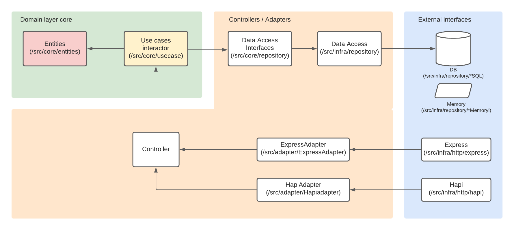
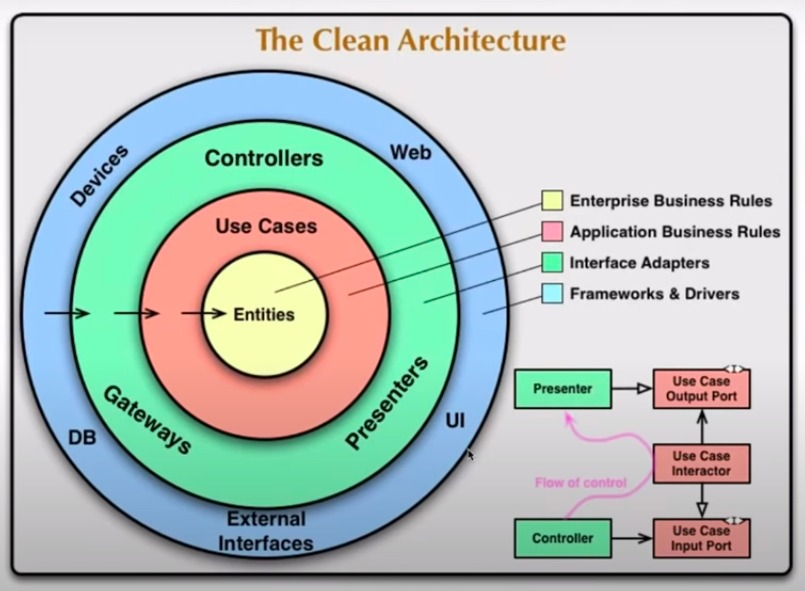

# Clean Architecture practice

A project in which it aplies the concepts of Clean Architecture.

## Clean Archtect

* Excessive couplement generates inflexibility, making an application unabled of any evolution, becaming legacy and needed to be totally dveloped again from zero.

* Business rules generally does not change, but can evolve themselves.

* Clean Architecture prevents the application to take the risk to not evolve anymore over the time;

* We can not choose the business rules, but we can choose the technologies and it could be deprecated;

* There is no sense to change the framework, for example, and must have to manipulate the business rules;

* Software architecting is a way to plan and develop an application that remains itself and pays itself over time, meaning it is a sustainable application;

* History:
 * DDD - Eric Evans - 2003;
 * Hexagonal - Cockburn - 2005;
 * Orion Arch - Jeff Palermo - 2008;
 * Clean Archtecture - Robert Martin - Uncle Bob - 2012.
 * The similarity of these approachs is the heart of an application is centralized and separated / uncoupled from another layers / components.

* In Clean Archtecture we focus on the business rules and leave the details for later (e.g. DB, HTTP framework...);

* The center of an application is not the database, or the framework to be used, but the use cases of the application;

* Clean Arch is an archtectural strategy decoupling oriented among the business rules of an application and the external resources:

* Use cases + entities = Core;
* Use cases handles entities;
* Use cases access external resources (database, APIs, UIs...) through adapters interconnected by the corruption layer;
 - Adapters performs the conversion between a world to another world.

## Entities
 * Responsible for the concentration of the main participants of the business rules;
  * Business objects;
  * Applies rules which generally is part of onlye the entities.

## Use Cases
* Performs the orchestration of the entities at conception of the business rules;
 * It represents the business rules;
 * Use cases is not aware who is using it, whether it is consuming a JSON or XML format, for example, because it is using an adapter in order to be agnostic;
 * Throws business exceptions.

## Interface Adapters
* Performs translation between external world with the core (use cases and entities);
* Performs data exchanges between databases, GUI and / or another services used by the applciation;
* Defines interfaces in manner which one or more implementations could exists (implemented in a concret way);
* Usecases do not know where the data area coming from;

## Frameworks and Drivers
* It is a layer which performs que I/O with the application;
* DB, framework, third-part integrations, file system, and so on are some examples and they are purely tech aspects which not influence the core of the application;