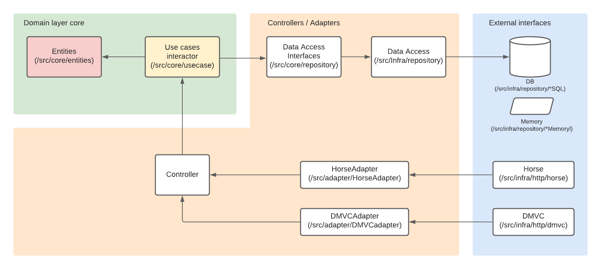
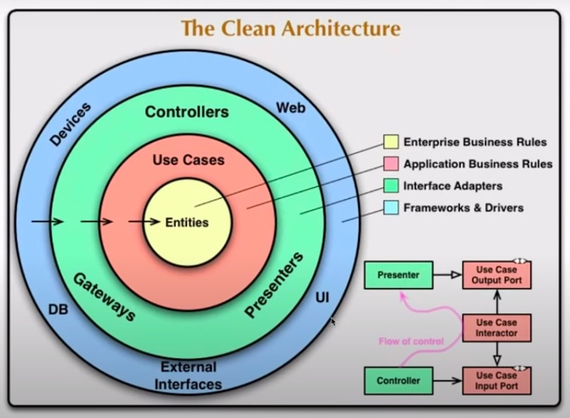

# Clean Architecture na prática

Um projeto no qual se aplicam os conceitos de Clean Architecture.

## Clean Archtect

* O excesso de acoplamento gera inflexibilidade. tornando um aplicativo inabilitado para quelquer evolução, tornando-se legado e precisando ser totalemente desenvolvido novamente do zero.

* As regras de negócios geralmente não mudam, mas podem evoluir.

* Clean Architecture evita que o aplicativo corra o risco de não evoluir mais com o passar do tempo;

* Não podemos escolher as regras de negócio, mas podemos escolher as tecnologias e pode ser descontinuado;

* Não faz sentido mudar o framework, por exemplo, e deve ter que manipular as regras de negócio;

* A arquitetura de software é uma forma de planejar e desenvolver um aplicativo que permanece ele mesmo e se paga ao logo do tempo, o que significa que é um aplicativo sustentável;

* história:
 * DDD - Eric Evans - 2003;
 * Hexagonal - Cockburn - 2005;
 * Orion Arch - Jeff Palermo - 2008;
 * Clean Archtecture - Robert Martin - Uncle Bob - 2012.
 * A semelhança dessas abordagens é que o coração de um aplicativo é centralizado e separado / desacoplado de outras camadas / componentes.

* Em Clean Architecture, nos concentramos nas regras de negócios e deixamos os detalhes para depois(por exemplo, DB, estrutura HTTP);

* O centro de um aplicativo não é o banco de dados ou a estrutura a ser usada, mas os casos de uso do aplicativo;

* Clean Architecture é uma estratégia arquitetônica de desacoplamento orientada entre as regras de negócio de uma aplicação e os recursos externos:

* Use cases + entities = Core;
* Use cases tratam entities;
* Use cases acessa recursos externos (database, APIs, UIs...) por meio de adaptadores interconectados pela camada de corrupção;
 - Adapters realizam a conversão de um mundo para outro mundo.

## Entities
 * Responsável pela concentração dos principais participantes das regras de negócio;
  * Objetos de negócios;
  * Aplica regras que geralmente fazem parte apenas das entidades.

## Use Cases
* Executa a orquestração das entidades na concepção das regras de negócios;
 * Representa as regras de negócios;
 * Os casos de uso não sabem quem está usando, se está consumindo um forma JSON ou XML, por exemplo, porque está usando um adaptador para ser agnóstico;
 * Lança exceções de negócios.

## Interface Adapters
* Executa a tradução entre o mundo externo e o núcleo (use cases e entities);
* Executa trocas de dados entre banco de dados, GUI e/ou outros serviçoes usados pelo aplicativo;
* Define interfaces de maneira que uma ou mais implementações possam existir(implementadas de forma concreta);
* Os casos de us não sabem de onde vem a área de dados;

## Frameworks and Drivers
* É uma camada que realiza I/O com a aplicação;
* DB, framework, integrações de terceiros, sistema de arquivos, e assim por diante são alguns exemplos e são aspectos puramente técnicos que não influenciam o núcleo do aplicativo;
